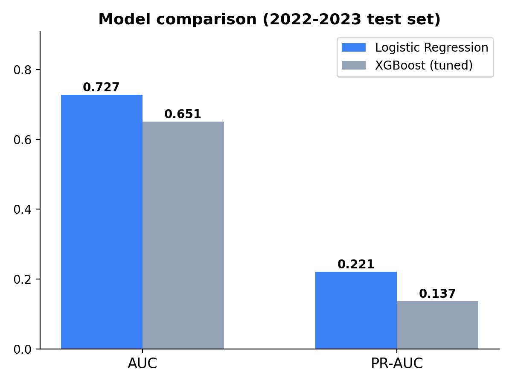
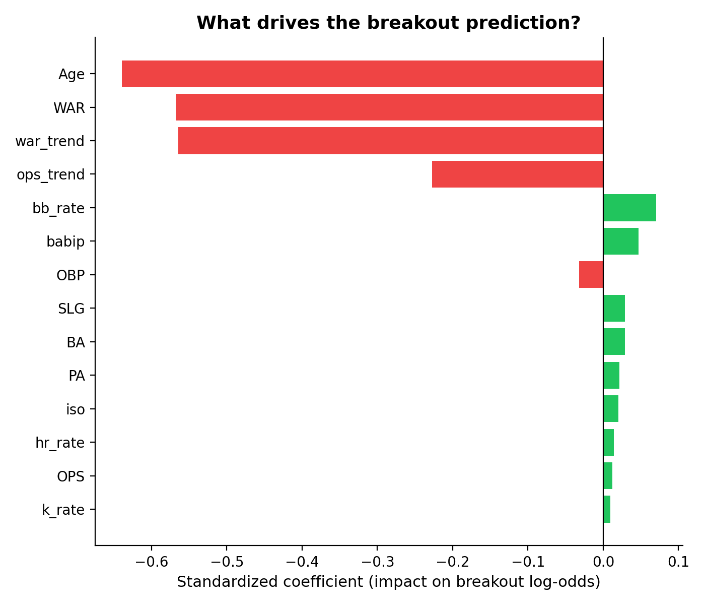
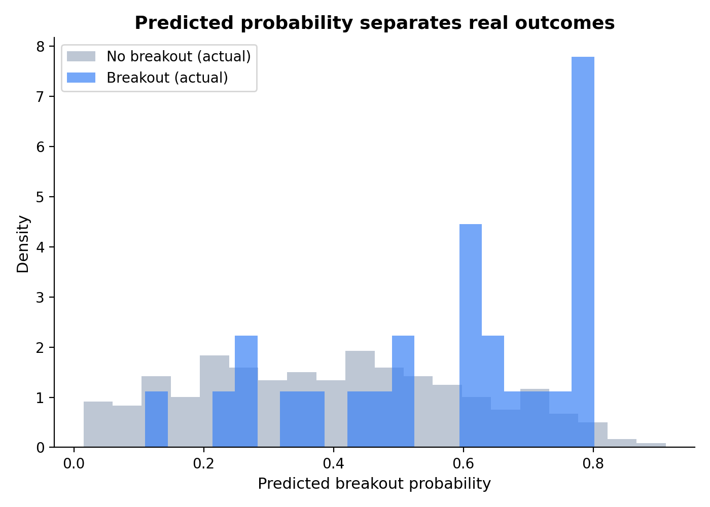

# MLB Hitter Breakout Predictor

Predicts whether an MLB batter is likely to have a breakout season (a 2.0+ WAR increase) the following year, based on age, performance level, plate discipline, and year-over-year trend.

**Live app:** https://mlb-breakout-predictor-ibmuwtzaru4599qrzxpi.streamlit.app/



## Goal

Identify batters who are likely to take a meaningful performance leap next season, using only information available through the end of their current season. The target use case: a scout, analyst, or fan wanting a data-driven signal for "who might break out next year" rather than relying on name recognition or media hype.

## Why this project

Most public breakout models either focus on top prospects only, or use vague heuristics ("young player with good plate discipline = breakout candidate"). I wanted to build something that:

1. Uses a precise, falsifiable definition of "breakout" (a specific WAR threshold, not a vibe)
2. Tests whether a more complex model (XGBoost) actually beats a simple one on this problem, rather than assuming complexity helps
3. Surfaces real-data edge cases that test the model's reasoning, not just aggregate metrics

## Data

- **Source:** Baseball-Reference, accessed via the `pybaseball` package
  - `bwar_bat()` for WAR (Baseball-Reference's `war_daily_bat` table — a direct data file, not a scraped page)
  - `batting_stats_bref(season)` for traditional counting/rate stats, pulled per-season
- **Span:** 2015-2024, batters only
- **Filtering:** Minimum 300 plate appearances in a season, to exclude injury-shortened, platoon, or late-callup seasons where small-sample rate stats are unreliable predictors

I originally used FanGraphs via `pybaseball.batting_stats()`, but FanGraphs actively blocks this scraper (HTTP 403) — a known, long-standing, unresolved issue in the library. Baseball-Reference's data file-based functions proved more reliable.

## Breakout definition

For a player in season N:

```
breakout = 1  if  player is qualified (300+ PA) in season N+1
             AND  WAR(N+1) - WAR(N) >= 2.0
```

This is a **relative, not absolute** definition — it captures *improvement*, not just "good player." A player coming off an elite season is correctly predicted as unlikely to break out again, simply because there's less room to climb further (see Results below for a concrete example).

## Features

All features are computed using only data through season N — no information from season N+1 leaks into the inputs.

- Age, WAR, PA (season N)
- Traditional rate stats: AVG, OBP, SLG, OPS
- Plate discipline: walk rate, strikeout rate
- Power: isolated power (ISO), home run rate
- Luck indicator: BABIP
- Trend: year-over-year change in WAR and OPS (season N vs. season N-1)

## Modeling approach

I trained both a logistic regression baseline and an XGBoost classifier, using a temporal train/test split (train: 2015-2021, test: 2022-2023) and class weighting to handle the ~13% breakout base rate.

### Result: the simpler model won

| Model | AUC | PR-AUC |
|---|---|---|
| **Logistic Regression** | **0.73** | **0.22** |
| XGBoost (tuned, regularized) | 0.65 | 0.14 |

I initially expected XGBoost to outperform, as it did on a prior shot-prediction project. It didn't — and tuning it toward a much more conservative configuration (shallow trees, heavy L2 regularization, high minimum samples per leaf) only partially closed the gap, never matching logistic regression.

**Why:** the breakout signal in this feature set appears to be largely linear/additive rather than driven by complex feature interactions. Logistic regression's inductive bias matches the true relationship better, and with a training set of ~500 rows (and only ~70 positive examples), XGBoost's extra flexibility mostly translates to overfitting rather than genuine signal capture.



The strongest signals, in order of magnitude: recent WAR/OPS trend, age, current power output (ISO, HR rate), and BABIP (capturing some mean-reversion effect from lucky/unlucky seasons).



The model meaningfully separates real breakout seasons from non-breakout seasons in the test set, even though the overlap is substantial — reflecting how genuinely hard this prediction problem is. By definition, a "breakout" is at least partly an unexpected event; if it were easily predictable from last year's stats, it wouldn't be surprising when it happens.

## A concrete example: why "already great" lowers breakout odds

Adam Eaton's 2016 season (6.7 WAR, up from 4.1 the year before — already a real breakout) gets a predicted 2017 breakout probability of only 12.8%, barely above the 6.5% league base rate. This isn't a model error: jumping by another 2.0+ WAR from an already-elite level is rare for any player. The model has correctly learned that recent improvement and current elite performance pull the prediction in opposite directions — recent positive trend raises the probability, but a high current WAR lowers it, since there's less room left to climb.

A more extreme version of the same effect shows up with Aaron Judge's historic 2024 season (10.9 WAR): the model predicts only a 0.8% breakout probability for 2025, well below the 6.5% league base rate, despite a strong positive trend from the year before. There is essentially no realistic room for another 2.0+ WAR jump from one of the best offensive seasons in modern baseball.

## How to run it

```bash
git clone https://github.com/rohanc27/mlb-hitter-breakout-predictor.git
cd mlb-hitter-breakout-predictor
python3 -m venv .venv
source .venv/bin/activate
pip install -r requirements.txt

# Pull data (takes ~1 minute)
python -m src.data.pull_batting_stats

# Build features and labels
python -m src.features.build_features

# Train models
python -m src.models.train_logreg
python -m src.models.train_xgb

# Score any player/season from the command line
python scripts/predict.py --name "Aaron Judge" --year 2018

# Or launch the interactive app
streamlit run app/streamlit_app.py
```

## Project structure

```
mlb-hitter-breakout-predictor/
├── src/
│   ├── data/pull_batting_stats.py     # Baseball-Reference data pull
│   ├── features/build_features.py     # Labels + leakage-free features
│   └── models/
│       ├── train_logreg.py
│       └── train_xgb.py
├── scripts/
│   ├── predict.py                     # CLI prediction tool
│   └── make_readme_figures.py
├── app/
│   └── streamlit_app.py               # Interactive web app
├── data/processed/breakout_features.parquet
├── models/logreg.joblib               # Production model
└── figures/
```

## Limitations

- Sample size is modest (~500 training rows, ~70 positive examples) — a real constraint on how much signal any model can extract
- No fielding/defensive value beyond what's baked into WAR itself
- No injury, trade context, or coaching-change signals, which can meaningfully affect breakout likelihood
- The 300 PA cutoff excludes some legitimate partial-season breakouts (e.g., a strong rookie call-up)